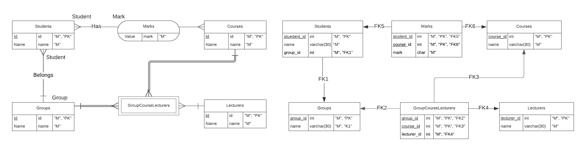

# 1. Первая нормальная форма
## 1.1. Описание
Дано отношение с атрибутами StudentId, StudentName, GroupId, GroupName, CourseId, CourseName, LecturerId, LecturerName, Mark.

Используем функциональные зависимости из прошлого ДЗ:
1. StudentId -> StudentName, GroupId
2. GroupId -> GroupName
3. CourseId -> CourseName
4. LecturerId -> LecturerName
5. GroupId, CourseId -> LecturerId
6. StudentId, CourseId -> Mark
7. GroupName -> GroupId

Отношение (StudentId, StudentName, GroupId, GroupName, CourseId, CourseName, LecturerId, LecturerName, Mark) находится в 1НФ, т.к.
1. В отношении нет повторяющихся групп - следует из условия/предметной области
2. Все атрибуты атомарны - следует из условия/предметной области
3. У отношения есть ключ (StudentId, CourseId) - известно из предыдущего ДЗ

## 1.2. Результат
(StudentId, StudentName, GroupId, GroupName, CourseId, CourseName, LecturerId, LecturerName, Mark) => (StudentId, StudentName, GroupId, GroupName, CourseId, CourseName, LecturerId, LecturerName, Mark)

# 2. Вторая нормальная форма
## 2.1. Описание
Отношение находится в 2НФ, если:
1. Оно находится в 1НФ - верно из п.1
2. Неключевые атрибуты функционально зависят от ключа в целом.
   Нарушается для CourseId -> CourseName. CourseName зависит только от части ключа в виде CourseId.

   Декомпозируем (StudentId, StudentName, GroupId, GroupName, CourseId, CourseName, LecturerId, LecturerName, Mark) по CourseId -> CourseName:
   1. (CourseId, CourseName)
   2. (StudentId, StudentName, GroupId, GroupName, CourseId, LecturerId, LecturerName, Mark)

   В отношении 2 нарушается 2НФ для StudentId -> StudentName, GroupId. StudentName зависит только от части ключа в виде StudentId. Однако такая декомпозиция разделит CourseId и GroupId, поэтому чтобы сохранить ФЗ GroupId, CourseId -> LecturerId, декомпозируем сначала по ней, предварительно добавив с правой стороны LecturerName (т.к. есть LecturerId -> LecturerName).

   Декомпозируем 2 отношение по GroupId, CourseId -> LecturerId, LecturerName
   1. (CourseId, CourseName)
   2. (GroupId, CourseId, LecturerId, LecturerName)
   3. (StudentId, StudentName, GroupId, GroupName, CourseId, Mark)

   В отношении 3 нарушается 2НФ для StudentId -> StudentName, GroupId. StudentName зависит только от части ключа в виде StudentId. Декомпозируем по ней, предварительно добавив с правой стороны GroupName (т.к. GroupName выводится из StudentId: {StudentId} -> {StudentId, StudentName, GroupId} -> {StudentId, StudentName, GroupId, GroupName}):

   Декомпозируем 3 отношение по  StudentId -> StudentName, GroupId, GroupName
   1. (CourseId, CourseName) - ФЗ 3. Ключ - {CourseId}. 2НФ
   2. (GroupId, CourseId, LecturerId, LecturerName) - ФЗ 4, 5. Ключ - {GroupId, CourseId}. 2НФ
   3. (StudentId, CourseId, Mark) - ФЗ 6. Ключ - {StudentId, CourseId}. 2НФ
   4. (StudentId, StudentName, GroupId, GroupName) - ФЗ 1, 2, 7. Ключ - {StudentId}. 2НФ

## 2.2. Результат
(StudentId, StudentName, GroupId, GroupName, CourseId, CourseName, LecturerId, LecturerName, Mark) => (CourseId, CourseName); (GroupId, CourseId, LecturerId, LecturerName); (StudentId, CourseId, Mark); (StudentId, StudentName, GroupId, GroupName)

# 3. Третья нормальная форма
## 3.1. Описание
Отношение находится в 3НФ, если:

1. Оно находится в 2НФ - верно из п.2
2. Неключевые атрибуты непосредственно (не транзитивно) зависят от ключей
   1. (CourseId, CourseName) - ФЗ 3. Ключ - {CourseId}. CourseName непосредственно зависит от CourseId. 3НФ
   2. (GroupId, CourseId, LecturerId, LecturerName) - ФЗ 4, 5. Ключ - {GroupId, CourseId}. LecturerName зависит от LecturerId, значит транзитивно зависит от GroupId, CourseId.
      Декомпозируем по LecturerId -> LecturerName
     1. (GroupId, CourseId, LecturerId) - ФЗ 5. Ключ - {GroupId, CourseId}. 3НФ
     2. (LecturerId, LecturerName) - ФЗ 4. Ключ - {LecturerId}. 3НФ
   3. (StudentId, CourseId, Mark) - ФЗ 6. Ключ - {StudentId, CourseId}. Mark непосредственно зависит от StudentId, CourseId. 3НФ
   4. (StudentId, StudentName, GroupId, GroupName) - ФЗ 1, 2, 7. Ключ - {StudentId}. GroupName зависит от GroupId, значит транзитивно зависит от StudentId.
     Декомпозируем по GroupId -> GroupName
      1. (StudentId, StudentName, GroupId) - ФЗ 1. Ключ - {StudentId}. 3НФ
      2. (GroupId, GroupName) - ФЗ 2, 7. Ключи - {GroupId}, {GroupName}. 3НФ

## 3.2. Результат
(CourseId, CourseName) => (CourseId, CourseName)
(GroupId, CourseId, LecturerId, LecturerName) => (GroupId, CourseId, LecturerId); (LecturerId, LecturerName)
(StudentId, CourseId, Mark) => (StudentId, CourseId, Mark)
(StudentId, StudentName, GroupId, GroupName) => (StudentId, StudentName, GroupId); (GroupId, GroupName)

# Б. Нормальная форма Бойса-Кодта
## Б.1. Описание
Отношение находится в НФБК, если в каждой нетривиальной функциональной зависимости X -> Y, X является надключом
Также отметим, что по первой теореме Дейта-Фейгина, если отношение находится в 3НФ и все ключи простые, то отношение находится в 5НФ.
1. (CourseId, CourseName) - ФЗ 3. Ключ - {CourseId}. 3НФ. Все ключи простые, значит 5НФ по первой теореме  Дейта-Фейгина.
2. (GroupId, CourseId, LecturerId) - ФЗ 5. Ключ - {GroupId, CourseId}. 3НФ. В единственной ФЗ левая часть надключ. НФБК.
3. (LecturerId, LecturerName) - ФЗ 4. Ключ - {LecturerId}. 3НФ. Все ключи простые, значит 5НФ по первой теореме  Дейта-Фейгина.
4. (StudentId, CourseId, Mark) - ФЗ 6. Ключ - {StudentId, CourseId}. 3НФ. В единственной ФЗ левая часть надключ. НФБК.
5. (StudentId, StudentName, GroupId) - ФЗ 1. Ключ - {StudentId}. 3НФ. Все ключи простые, значит 5НФ по первой теореме  Дейта-Фейгина.
6. (GroupId, GroupName) - ФЗ 2, 7. Ключи - {GroupId}, {GroupName}. 3НФ. Все ключи простые, значит 5НФ по первой теореме  Дейта-Фейгина.

## Б.2. Результат
(CourseId, CourseName) => (CourseId, CourseName)
(GroupId, CourseId, LecturerId) => (GroupId, CourseId, LecturerId)
(LecturerId, LecturerName) => (LecturerId, LecturerName)
(StudentId, CourseId, Mark) => (StudentId, CourseId, Mark)
(StudentId, StudentName, GroupId) => (StudentId, StudentName, GroupId)
(GroupId, GroupName) => (GroupId, GroupName)

# 4. Четвёртая нормальная форма
## 4.1. Описание
Отношение находится в 4НФ, если для каждой нетривиальной МЗ X -> Y|Z, X – надключ
Рассмотрим отношения, которые находятся в НФБК (остальные в 5НФ, она сильнее 4НФ)
1. (GroupId, CourseId, LecturerId). Рассмотрим возможные МЗ (отметим, что X -> Y|Z <=> X -> Z|Y, так что можно рассмотреть один из двух вариантов):
   1. GroupId -> CourseId|LecturerId
      Контрпример в формате (GroupId, CourseId, {LecturerId}). В качестве Id для удобства используются имена
      ("M3239", "ДМ", {"Станкевич"})
      ("M3239", "АиСД", {"Маврин"})
      При различных CourseId имеем различные LecturerId, значит GroupId -> CourseId|LecturerId - не МЗ
   2. CourseId -> GroupId|LecturerId
      Контрпример в формате (CourseId, GroupId, {LecturerId}). В качестве Id для удобства используются имена
      ("ДМ", "M3439", {"Станкевич"})
      ("ДМ", "M3437", {"Васильев"})
      При различных GroupId имеем различные LecturerId, значит CourseId -> GroupId|LecturerId - не МЗ
   3. LecturerId -> GroupId|CourseId
      Контрпример в формате (LecturerId, GroupId, {CourseId}). В качестве Id для удобства используются имена
      ("Станкевич", "M3339", {"Теория сложности"})
      ("Станкевич", "M3239", {"ДМ"})
      При различных GroupId имеем различные CourseId, значит LecturerId -> GroupId|CourseId - не МЗ
2. (StudentId, CourseId, Mark). Рассмотрим возможные МЗ (отметим, что X -> Y|Z <=> X -> Z|Y, так что можно рассмотреть один из двух вариантов):
   1. StudentId -> CourseId|Mark
      Контрпример в формате (StudentId, CourseId, {Mark}). В качестве Id для удобства используются имена
      ("Андрей", "ДМ", {5})
      ("Андрей", "АиСД", {3})
      При различных CourseId имеем различные Mark, значит StudentId -> CourseId|Mark - не МЗ
   2. CourseId -> StudentId|Mark
      Контрпример в формате (CourseId, StudentId, {Mark}). В качестве Id для удобства используются имена
      ("АиСД", "Андрей", {3})
      ("АиСД", "Никита", {5})
      При различных StudentId имеем различные Mark, значит CourseId -> StudentId|Mark - не МЗ
   3. Mark -> StudentId|CourseId
      Контрпример в формате (Mark, StudentId, {CourseId}). В качестве Id для удобства используются имена
      (5, "Андрей", {ДМ})
      (5, "Никита", {ДМ, АиСД})
      При различных StudentId имеем различные CourseId, значит CourseId -> StudentId|Mark - не МЗ

Нетривиальных МЗ нет, значит рассмотренные отношения находятся в 4НФ.
## 4.2. Результат
(CourseId, CourseName) => (CourseId, CourseName)
(GroupId, CourseId, LecturerId) => (GroupId, CourseId, LecturerId)
(LecturerId, LecturerName) => (LecturerId, LecturerName)
(StudentId, CourseId, Mark) => (StudentId, CourseId, Mark)
(StudentId, StudentName, GroupId) => (StudentId, StudentName, GroupId)
(GroupId, GroupName) => (GroupId, GroupName)

# 5. Пятая нормальная форма
## 5.1. Описание
Для каждой нетривиальной ЗС ∗{X1,X2,...,Xn} каждое X_i – надключ
Рассмотрим отношения, которые еще не находятся в НФБК
1. (GroupId, CourseId, LecturerId)
   Рассмотрим возможные ЗС.
   1. Заметим, что 4НФ рассматривает разбиения на два множества, значит требуется рассмотреть разбиения на 3 или больше множеств X_i.
   2. Также отметим, что рассматривать разбиения, в которых X_i является подмножеством или равно X_j не требуется, т. к. по коммутативности сразу объединим X_i и X_j, получив в точности X_j, тем самым сведя данное разбиение к разбиению меньшего размера.
   3. Помимо этого не требуется рассматривать разбиения, в которых присутствует полное X_i, то есть включающее все атрибуты, т.к. такая ЗС тривиальна.
   Следовательно надо рассмотреть разбиения на множества размера 1 или 2, в которых не менее 3 множеств.
   Различных подмножеств атрибутов размера 2 - 3 штуки. Размера 1 тоже 3 штуки. Если в нашем разбиении встречаются X_i размера 2 и X_i размера 1, то имеет место п.2, т.к.
     1. либо есть 2 множества размера 2, покрывающие все три столбца, тогда множество размера 1 является подмножеством.
     2. либо есть два множества размера 1, тогда множество размера 2 содержит одно из этих множеств.
  Значит в разбиении встречаются только множества одного размера. При этом различных множеств каждого размера три, значит следует рассмотреть разбиения {{GroupId}, {CourseId}, {LecturerId}} и {{GroupId, CourseId}, {CourseId, LecturerId}, {GroupId, LecturerId}}
   1. *{{GroupId}, {CourseId}, {LecturerId}}
      Контрпример в форме (GroupId, CourseId, LecturerId)
      (M3439, БД, Корнеев)
      (M3139, ДМ, Станкевич)
      Разобьется на таблицы
        GroupId: (M3439), (M3139)
        CourseId: (БД), (ДМ)
        LecturerId: (Корнеев), (Станкевич)
      При склейке GroupId и CourseId уже получим строку (M3139, БД), которой не было.
      Значит {{GroupId}, {CourseId}, {LecturerId}} - не ЗС
   2. *{{GroupId, CourseId}, {CourseId, LecturerId}, {GroupId, LecturerId}}
      Контрпример в форме (GroupId, CourseId, LecturerId)
      (M3439, БД, Корнеев)
      (M3139, Прог, Корнеев)
      Разобьется на таблицы
        (GroupId, CourseId): (M3439, БД), (M3139, Прог)
        (CourseId, LecturerId): (БД, Корнеев), (Прог, Корнеев)
        (GroupId, LecturerId): (M3439, Корнеев), (M3139, Корнеев)
      При склейке (GroupId, LecturerId) и (CourseId, LecturerId) уже получим строку (M3439, Корнеев, Прог), которой не было.
      Значит {{GroupId, CourseId}, {CourseId, LecturerId}, {GroupId, LecturerId}} - не ЗС.
2. (StudentId, CourseId, Mark)
   По аналогичным п.1 рассуждениям требуется рассмотреть только два варианта:
   1. *{{StudentId}, {CourseId}, {Mark}}
      Контрпример в форме (StudentId, CourseId, Mark)
      (Андрей, БД, 2)
      (Никита, ДМ, 5)
      Разобьется на таблицы
        StudentId: (Андрей), (Никита)
        CourseId: (БД), (ДМ)
        Mark: (2), (5)
      При склейке StudentId и CourseId уже получим строку (Никита, БД), которой не было.
      Значит {{StudentId}, {CourseId}, {Mark}} - не ЗС
   2. *{{StudentId, CourseId}, {CourseId, Mark}, {StudentId, Mark}}
      Контрпример в форме (StudentId, CourseId, Mark)
      (Андрей, АиСД, 5)
      (Никита, ДМ, 5)
      Разобьется на таблицы
        (StudentId, CourseId): (Андрей, АиСД), (Никита, ДМ)
        (CourseId, Mark): (АиСД, 5), (ДМ, 5)
        (StudentId, Mark): (Андрей, 5), (Никита, 5)
      При склейке (StudentId, Mark) и (CourseId, Mark) уже получим строку (Андрей, 5, ДМ), которой не было.
      Значит {{StudentId, CourseId}, {CourseId, Mark}, {StudentId, Mark}} - не ЗС.
Нетривиальных ЗС нет, значит отношения находятся в 5НФ. Ура!

## 5.1. Результат
(CourseId, CourseName) => (CourseId, CourseName)
(GroupId, CourseId, LecturerId) => (GroupId, CourseId, LecturerId)
(LecturerId, LecturerName) => (LecturerId, LecturerName)
(StudentId, CourseId, Mark) => (StudentId, CourseId, Mark)
(StudentId, StudentName, GroupId) => (StudentId, StudentName, GroupId)
(GroupId, GroupName) => (GroupId, GroupName)

# 6. Модели
## 6. Диаграммы ERM и PDM

[Lucid Diagram](https://lucid.app/lucidchart/970b33cd-0555-46d1-86d6-0db6c58d1bc5/edit?viewport_loc=598%2C181%2C1412%2C709%2C0_0&invitationId=inv_43c5b56f-59f7-4470-9113-4ec1e8083816)

# 7. SQL
## 7.1. DDL
[Source](ddl.sql)

## 7.2. DML
[Source](ddl.sql)